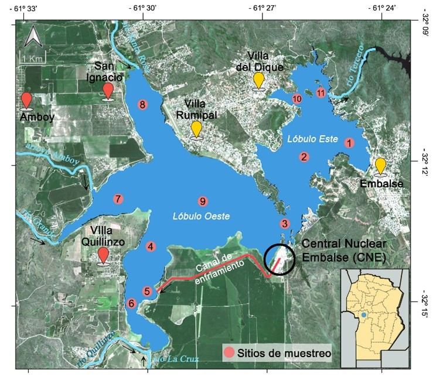
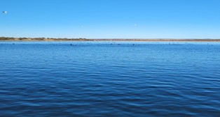
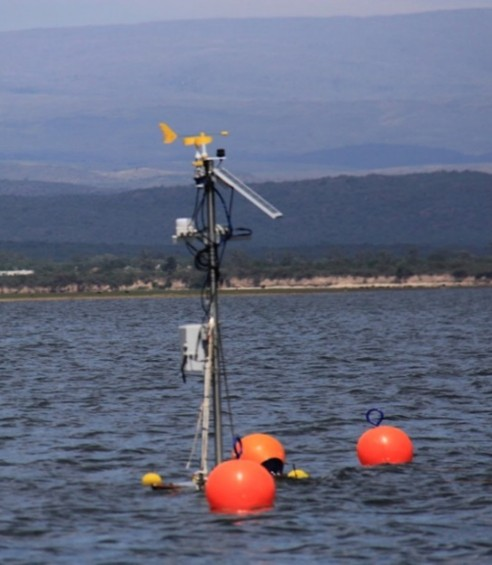

# Consideraciones generales

```{r}
año_actual <- 2025
mes_actual <- 10

mes_actual_chr <- if (mes_actual <= 9) {
  paste0("0", mes_actual)
} else {
  as.character(mes_actual)
}

mes_prev_chr <- if ((mes_actual - 1) <= 9) {
  paste0("0", mes_actual - 1)
} else {
  as.character(mes_actual - 1)
}

fecha_actual <- as.Date(paste0(año_actual, "-", mes_actual_chr, "-01"))
mes_etq <- format(fecha_actual, "%B")

fecha_prev <- as.Date(paste0(año_actual, "-", mes_actual_chr, "-01"))
mes_prev_etq <- format(fecha_prev, "%B")

# source("scripts/lectura_excel.R")
# source("scripts/lectura_micro.R")
source("scripts/.soporte.R")

fecha_muestreo <- max(d$fecha, na.rm = TRUE)
fecha_muestreo_etq <- format(fecha_muestreo, "%d de %B de %Y")
```

<!-- [Get out]{custom-style="Rojo"}, he said. -->

<!-- Dickinson starts the poem simply: -->

<!-- ::: {custom-style="Rojo"} -->
<!-- | A Bird came down the Walk--- -->
<!-- | He did not know I saw--- -->
<!-- ::: -->

En el marco del Programa de Monitoreo Sistemático de la Calidad del Agua del Embalse Río Tercero, y a solicitud de la **Autoridad de Cuencas**, el día **`{r} fecha_muestreo_etq`** se realizó la campaña de muestreo correspondiente a dicho mes, con el fin de monitorear y determinar el estado trófico y la calidad de sus aguas. 

En estas campañas se monitorearon 11 sitios de muestreo predeterminados, en los cuales se evaluaron distintas variables físicas, químicas y biológicas a nivel sub-superficial (@fig-localizacion).

{#fig-localizacion}

```{r}
#| tbl-cap: Nombre de los sitios de muestreo
#| label: tbl-localizacion

data.frame(
  x = 1:11,
  s = c(
    "Club Almafuerte",
    "Hoteles",
    "Garganta",
    "Entrada Ríos y CNE",
    "Canal de enfriamiento",
    "Confluencia ríos",
    "Ingreso río Grande",
    "Ingreso río Santa Rosa",
    "Centro",
    "Villa del dique",
    "Presa"
  )
) |>
  transmute(s = paste0(x, ".- ", s)) |>
  knitr::kable(col.names = "**Sitios de muestreo (SM)**", align = "l")
```

Las campañas de muestreo fueron coordinadas por personal del **Instituto de Ciencia de la Tierra, Biodiversidad y Ambiente (ICBIA, CONICET-UNRC)** y la **Facultad de Ciencias Exactas, Físico-Químicas y Naturales, Universidad Nacional de Río Cuarto (FCEFQyN, UNRC)**. Además, se contó con el apoyo del **Instituto Gulich (IG, UNC-CONAE)**, el **Ministerio de Ambiente y Economía Circular** de la Provincia de Córdoba y la **Fundación Río Ctalamochita**. La embarcación y personal especializado fue aportado por el **Departamento Unidades de Alto Riesgo (DUAR)** perteneciente a la Policía de la Provincia de Córdoba y por la **Dirección de Seguridad Náutica (DSN)** provincial.

La campaña de muestre comenzó a las 10.00 hs y finalizó a las 13.30 hs. El día presentó condiciones meteorológicas óptimas para la realización del mismo. La temperatura ambiente registrada fue de 6 °C, los vientos de 4 km/h de intensidad, con dirección nor-noroeste (NNO). 

El embalse presentó una coloración del agua clara, sin registrarse la presencia de florecimientos de algas/cianobacterias importantes en su superficie (@fig-condicion-agua). 

{#fig-condicion-agua}

A partir de los datos aportados por  <https://www.cba.gov.ar/nivel-dediques-y-embalses/>, se determinó que en la fecha de muestreo el embalse presentó una cota de 45.8 m, localizándose 0.72 m por debajo de la cota vertedero (@fig-cota-año). Se estima que, en la fecha monitoreada, el embalse alcanzó una superficie aproximada de 4134 ha, es decir, 366 ha menos que la superficie correspondiente a la cota del vertedero (4500 ha).

En base al análisis temporal de la cota del embalse generada para el período comprendido entre los años 2010 a 2025, se observa que el nivel actual es la esperable para la época del año (@fig-cota-tendencia).

::: {#fig-cotas}

```{r}
#| label: fig-cota-año
#| fig-cap: Nivel de cota vertedero del último año
#| fig-width: 5
#| fig-height: 2

source("scripts/figura_cota_año.R")
g_cota_año
```

```{r}
#| label: fig-cota-tendencia
#| fig-cap: Tendencia de cota (2010-2025)
#| fig-width: 5
#| fig-height: 2

source("scripts/figura_cota_tendencia.R")
g_cota_hist
```

Evolución de la cota del Embalse.

:::

Se espera que el nivel de agua continúe descendiendo hasta los meses de octubre-noviembre que es cuando alcanza los valores de cota mínimos, para luego aumentar el nivel embalsado producto de la regulación del mismo y las precipitaciones en la cuenca. Esta tendencia coincide con lo que se registra en los demás embalses de la provincia.

# Mediciones y observaciones a campo 

La @tbl-parametros muestran los registros de la variables medidas In-situ en el embalse Río Tercero durante la última campañas de muestreo.

```{r}
#| label: tbl-parametros
#| tbl-cap: Determinaciones fisico-químicas básicas obtenidas para el embalse Río Tercero **Octubre de 2025**.

source("scripts/tabla_parametros.R")
tabla_parametros_md
```

La @fig-param-campo muestra la dinámica de las principales variables medidas durante esta campaña, su comparación con el mes anterior (`{r} mes_prev_etq` 2025) y el mismo mes del año previo (Octubre de `{r} año_actual - 1`).

```{r}
#| label: fig-param-campo
#| fig-cap: Variación temporal de las variables medidas a campo
#| fig-width: 5
#| fig-height: 3

source("scripts/figura_parametros.R")
g_param
```

La @tbl-calidad-agua muestra las concentraciones de aniones, cationes y nutrientes más importantes  registrados para dicho monitoreo. Para este análisis, se evaluó un sitio representativo de cada Lóbulo del embalse, con el fin de obtener una visión general de la calidad del agua en todo el reservorio. 



```{r}
#| label: tbl-calidad-agua
#| tbl-cap: Determinaciones fisico-químicas básicas obtenidas para el embalse Río Tercero **Octubre de 2025**.

source("scripts/tabla_calidad_agua.R")
tabla_calidad_md
```

A partir del análisis estadístico de los datos medidos a campo, se observó una zonificación en la calidad del agua del embalse. En el Lóbulo Oeste se observaron los valores más elevados de CE y SDT (ANOVA, $p-test < 0.05$). Esta tendencia también se evidenció en las variables Temp, pH y Turb, aunque sin encontrarse diferencias significativas (ANOVA, $p-test > 0.05$). 

Por el contrario, las variables OD, DS, Cl-a y Cl-a(Ciano) evidenciaron registros más elevados en el Lóbulo Este que en el Oeste, aunque no se registraron diferencias estadísticamente significativas (ANOVA, $p-test > 0.05$). 

El análisis realizado hace suponer una mayor concentración de sólidos en el Lóbulo Oeste del embalse, probablemente asociado al aporte de sedimentos por parte de los ríos tributarios. En contraste, el Lóbulo Este presentó características ópticas compatibles con una mayor productividad primaria y una coloración verdosa del agua. 

Cabe destacar que se registraron concentraciones inusualmente elevadas de nutrientes. Sin embargo, la fiabilidad de estos datos está siendo sometida a verificación con el laboratorio responsable del análisis, ya que los mismos exceden significativamente los rangos promedio registrados con anterioridad en este reservorio.

La determinación geo-química del agua evidenció que en todo el embalse la calidad del agua se clasificó como duce, blanda y bicarbonatada sódica-cálcica.

En cuanto a la clasificación para distintos usos, el agua del embalse se clasificó como deficiente en sales para ganadería [@bavera2001manual]. Mientras que, para consumo humano, se determinó que los elementos y propiedades analizadas cumplen con los límites recomendados por el Código Alimentario Argentina (CAA) y por la Secretaría de Recursos Hídricos de la Provincia de Córdoba. Sin embargo, para alcanzar la definición de aptitud para consumo humano se debe complementar con el análisis microbiológico correspondiente. 

A continuación se detalla la dinámica de las principales variables medidas: 

```{r}
source("scripts/figura_temperatura_agua.R")
```

**- Temperatura del agua (Temp)**: Durante el mes de Octubre esta variable presentó una media de `{r} temp0` ± `{r} temp0_sd` °C. Al corresponder a la estación climática de Otoño, la temperatura del agua estuvo por debajo de la temperatura media de referencia del embalse registrada para el período 2015-2024 (`{r} temp_p` ± `{r} temp_p_sd` °C) (@fig-temperatura).

```{r}
#| label: fig-temperatura
#| fig-cap: Variación temporal de la temperatura del agua del embalse

g_temp
```

El análisis temporal demostró que los valores registrados durante la presente campaña fueron inferiores a los registrados durante el mes de `{r} mes_prev_etq` (`{r} temp1` ± `{r} temp1_sd` °C), pero similares a los registros de Octubre del año `{r} año_actual - 1` (`{r} temp2` ± `{r} temp2_sd` °C).

Respecto a la variación espacial, tanto los datos recolectados a campo como la información aportada por el análisis satelital de una imagen Landsat 8 TIRS del área de estudio (Fecha de adquisición 20 de Octubre de 2025), demuestran que los valores bajos y homogéneos se registraron en el Lóbulo Este del embalse.  Mientras que el Lóbulo Oeste, registró los valores más heterogéneos, lo cual estuvo marcada por el ingreso de flujos de agua con baja temperatura por los ríos tributarios (> 14 °C) y altos valores de temperatura asociados a la pluma térmica generada por el canal de enfriamiento de la central nuclear (< 17 °C) (@fig-mapa-temp).

```{r}
#| label: fig-mapa-temp
#| fig-cap: Variación espacial de la temperatura del agua del embalse
#| fig-width: 5
#| fig-height: 5

source("scripts/mapa_temperatura.R")
mapa_temperatura
```

Como fuente de información adicional se cuenta con una plataforma de medición en tiempo real de variables hidro-meteorológicas que pertenece al Gobierno de la Provincia de Córdoba y que es operada por el Observatorio Hidrometeorológico (MAAySP) en cooperación con el Laboratorio de Hidráulica (LH, UNC) (@fig-estacion-hidro). 

{#fig-estacion-hidro}

A partir de los datos aportado por esta estación, la cual está ubicada en la zona de la garganta del embalse (SM 3), se constató que durante la campaña de muestreo la columna de agua presentó una estructura térmica prácticamente homogénea, con una diferencia de temperatura de 0.25 °C entre la superficie (14.25 °C) y la zona profunda del embalse (12.4 m de profundidad, 14,0 °C).

**- pH**: Esta variable presento un valor medio de `{r} ph0` ± `{r} ph0_sd`, y un rango comprendido entre `{r} ph0_min` y `{r} ph0_max`. En base a estos datos se determinó que el pH se clasificó como neutro a ligeramente alcalino. Los registros encontrados de esta variable están dentro de los límites recomendados por el Código Alimentario Argentina. Además, el comportamiento de esta variable es normal para el mes analizado, estando en concordancia con los valores medios de referencia registrados para este embalse (`{r} ph_p` ± `{r} ph_p_sd`).

**- Oxígeno disuelto (OD)**: Se registró un valor medio normal para la época del año (`{r} od0` ± `{r} od0_sd` mg/l). Si bien estos valores fueron inferiores a los registrados en los meses previos, esta disminución podría atribuirse a la baja intensidad del viento registrada durante la campaña de muestreo (4 km/h). Los bajos vientos favorecen la formación de olas de menor energía que limitan la mezcla vertical de la columna de agua. En consecuencia, se reduce el intercambio de oxígeno entre la atmósfera y las capas superficiales del embalse.

```{r}
source("scripts/figura_transparencia.R")
```

**- Transparencia del agua (DS)**: La transparencia del agua medida con el disco de Secchi, registró un valor medio de (`{r} ds0` ± `{r} ds0_sd` m), con un amplio rango comprendido entre los 3.8 m en el Lóbulo Oeste (SM 7) y 5.5 m en el Lóbulo Este (SM 1 y 11).

Se observa una relación directa entre los valores recolectados a campo con aquellos estimados por teledetección (**Figura 8**). El Lóbulo Oeste presentó los valores más bajos y heterogéneos de transparencia del agua debido al ingreso de sólidos por parte de los ríos tributarios, lo que genera una disminución de la transparencia del agua. Por su parte, el Lóbulo Este presentó los registros más altos y homogéneos de transparencia, lo que coincide con la dinámica general de este reservorio (@bonansea2019evaluating).

[MAPA TRANSPARENCIA]{custom-style="Verbatim Char"}

En cuanto al análisis temporal, durante los últimos meses se está observando un aumento progresivo en la transparencia del agua. Los datos registrados durante el último monitoreo están muy por encima del valor medio de referencia del embalse (`{r} ds_p` ± `{r} ds_p_sd` m), y del valor medio registrado en Octubre `{r} año_actual - 1` el cual fue de `{r} ds1` ± `{r} ds1_sd` m (@fig-transparencia).

```{r}
#| label: fig-transparencia
#| fig-cap: Variación temporal de la transparencia del agua del embalse

g_ds
```

**- Sólidos Disueltos Totales (SDT)**: Esta variable presento un rango de `{r} sdt0_min` a `{r} sdt0_max` ppm con un valor medio de `{r} sdt0` ± `{r} sdt0_sd` ppm. Se observan diferencias estadísticas significativas al clasificar esta variable por ubicación espacial (ANOVA, $p-test < 0.05$). Asi, el Lóbulo Oeste presentó los valores medios más altos de SDT (82.0 ± 1.4 ppm). Mientras que el Lóbulo Este presentó las concentraciones más bajas (78.6 ± 1.9 ppm).

**- Turbidez (Turb)**: Esta variable presentó el mismo comportamiento que los SDT. Su media fue de `{r} turb0` ± `{r} turb0_sd` NTU, con un rango comprendido entre `{r} turb0_min` y `{r} turb0_max` NTU. 

**- Conductividad Eléctrica (CE)**: El valor medio de esta variable fue de `{r} ce0` ± `{r} ce0_sd` µS/cm, con un rango comprendido entre los 115.0 y 125.1 µS/cm. Al igual que los SDT, esta variable presentó diferencias estadísticamente significativas al ser analizadas por los Lóbulos del embalse (ANOVA, $p-test < 0.05$). En este sentido, las concentraciones medias más altas se encontraron en el Lóbulo Oeste (122.9 ± 1.9 µS/cm) y las más bajas en el Este (117.7 ± 1.8 µS/cm). 

Al igual que lo que ocurre con la transparencia del agua, el comportamiento de las variables SDT, Turb y CE, estuvo condicionada por el ingreso de agua con sedimentos por parte de los ríos tributarios, lo que genera una zonificación longitudinal de Oeste a Este en el reservorio. 

**- Concentración de Clorofila-a (Cl-a)**: Esta variable registró concentraciones bajas en todo el reservorio, sin encontrarse floraciones de algas/ cianobacterias en la superficie del mismo. La media registrada fue de `{r} cla0` ± `{r} cla0_sd` mg/m<sup>3</sup>, estando por debajo de la media de referencia para este reservorio (11.3 ± 12.4 mg/m3). Las concentraciones más bajas de Cl-a (`{r} cla0_min` mg/m3), se registraron en la zona del Centro (SM 9) y donde confluyen los ríos Quillinzo, La Cruz y el canal de enfriamiento de la Central Nuclear (SM 4). El valor más alto (`{r} cla0_max` mg/m3) se midió en la zona de los ríos tributarios La Cruz y Quillinzo (SM 6).

El procesamiento satelital confirmó el comportamiento de los datos recolectados a campo (**Figura 10**). En este sentido, se observó una distribución cuasi-homogénea en toda la superficie del embalse, con concentraciones relativamente bajas para toda la superficie del mismo.

[MAPA CLOROFILA-A]{custom-style="Verbatim Char"}

El análisis satelital además mostró lo que podría ser un florecimiento de cianobacterias en el centro del embalse (SM 9). Sin embargo, el mismo presentó concentraciones bajas y no fue diferenciado durante la campaña de monitoreo.

La dinámica temporal de esta variable (@fig-clorofila-a), mostró un descenso de la concentración de clorofila-a, lo que puede estar asociado a la época del año. El descenso de esta variable también puede influir en el aumento de la transparencia del agua.

```{r}
#| label: fig-clorofila-a
#| fig-cap: Variación temporal de la concentración de clorofila-a en el embalse

source("scripts/figura_clorofila-a.R")
g_clo
```

**- Concentración de Clorofila-a de Cianobacetrias (Cl-aCiano)**: Esta variable presentó valores muy bajos para toda la superficie del embalse (`{r} cla_ciano0` ± `{r} cla_ciano0_sd` mg/m3), con valores máximos que solo alcanzaron los `{r} cla_ciano0_max` mg/m3 en la zona de desembocadura del rio tributario Santa Rosa (SM 8) (**Figura 12**).

[MAPA CYANOBACTERIA]{custom-style="Verbatim Char"}

# Recuento de fitoplancton 

En base a la evaluación de la abundancia de fitoplancton (@fig-ciano) se observa que, aunque en baja densidad, las cianobacterias (Cyanophytas) son el grupo que más contribuyen a la biomasa total del embalse.

```{r}
#| label: fig-ciano
#| fig-cap: Distribución espacial de los principales grupos fitoplanctónicos medidos en el embalse durante la última campaña de monitoreo

source("scripts/figura_ciano.R")
g_ciano
```

Coincidiendo con la información satelital, se observó que las concentraciones más importantes de fitoplancton se encontraron en el Lóbulo Este (SM 1 y 2). En estos sitios se encontraron dominancia de cianobacterias (*Cyanophytas*). Este grupo fitoplanctónico también estuvo presente, aunque en menor proporción, en la zona de ingreso de los ríos tributarios Grande y Santa Rosa (SM 7 y 8). 

Las diatomeas (*Chrysophytas*) estuvieron presentes en todos los sitios, pero en menor proporción que las cianobacterias. Mientras que los grupos representados por criptófitas (*Pyrrophytas*) y clorófitas (*Chlorophytas*) presentaron valores muy bajos en todo el embalse, sin encontrarse diferencias entre los sitios de muestreo y aportando muy poco a la abundancia general del reservorio.

# Determinación del estado trófico 

Si bien la evaluación trófica se realiza como un valor promedio de todo un año monitoreado, al realizar una estimación mensual del Índice de Estado Trófico [@carlson1977trophic], se determinó que en los últimos meses el embalse está presentando una disminución en su estado trófico. Cabe mencionar que para este análisis no se consideró la variable fósforo total, ya que la concentración medida es atípica. 

En la actualidad, el embalse se encuentra en una situación mesotrófica baja. Esto, además de estar favorecido por la estación climática de Otoño, está estrechamente relacionado con los altos valores de transparencia del agua y bajas concentraciones de clorofila-a que se vienen registrando en las últimas campañas de monitoreo (@fig-tsi).

```{r}
#| label: fig-tsi
#| fig-cap: Distribución espacial de los principales grupos fitoplanctónicos medidos en el embalse durante la última campaña de monitoreo

source("scripts/figura_tsi.R")
g_tsi
```

# Consideraciones finales {.unnumbered}

A partir del análisis generado con la información de campo y en base a la información satelital se observó que durante el mes de Octubre de `{r} año_actual` el embalse Río Tercero presentó una buena calidad del agua y una condición de mesotrófía baja. Las variables medidas mostraron un comportamiento normal. Se destaca un aumento en la transparencia del agua progresivo desde los últimos meses. Además, se registró elevadas concentraciones de nutrientes: Sin embargo estas mediciones están siendo evaluadas. 

Este trabajo constituye un estudio sistemático y a largo plazo realizado por el Grupo de Monitoreo de Aguas Superficiales Interiores (GMASI) conformado por investigadores y becarios del Instituto de Ciencias de la Tierra, Biodiversidad y Ambiente (ICBIA, CONICET-UNRC) y del Instituto Gulich (UNC-CONAE), junto a la colaboración de distintas instituciones con el fin de obtener datos adecuados para una correcta evaluación de la calidad del agua del embalse Río Tercero.

Debido a la importancia social, económica y ecológica de este cuerpo de agua, es importante seguir monitoreando la calidad del agua y estado trófico del mismo, ya sea para obtener un mejor conocimiento del mismo, como así también para detectar o predecir cualquier modificación leve en las variables estudiadas, lo que podría traducirse en un desequilibrio del sistema. Los autores de este informe agradecen la participación de las diferentes instituciones en la realización y logística de los muestreos de rutina.

# Referencias bibliográficas {.unnumbered}

::: {#refs}
:::
